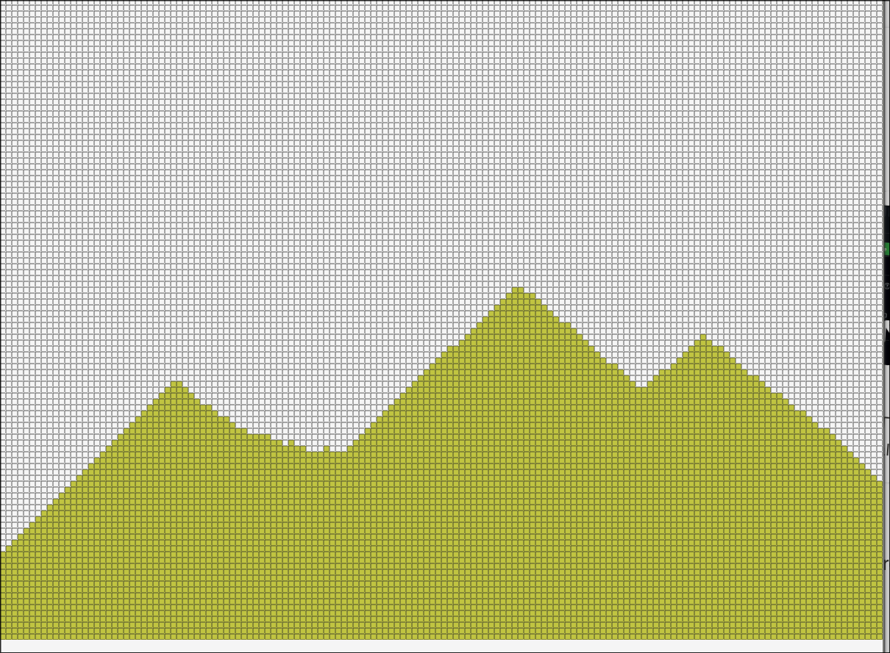
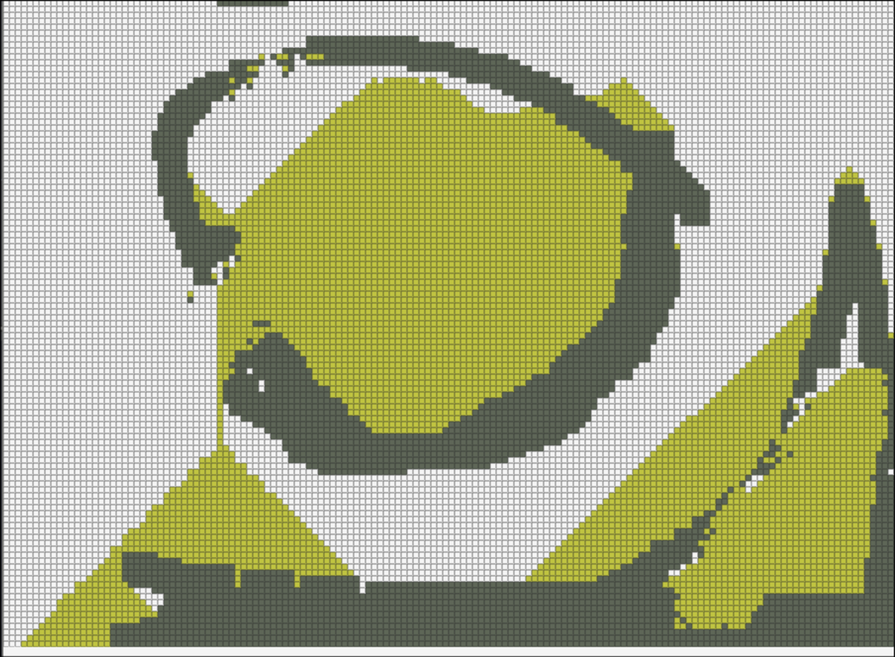
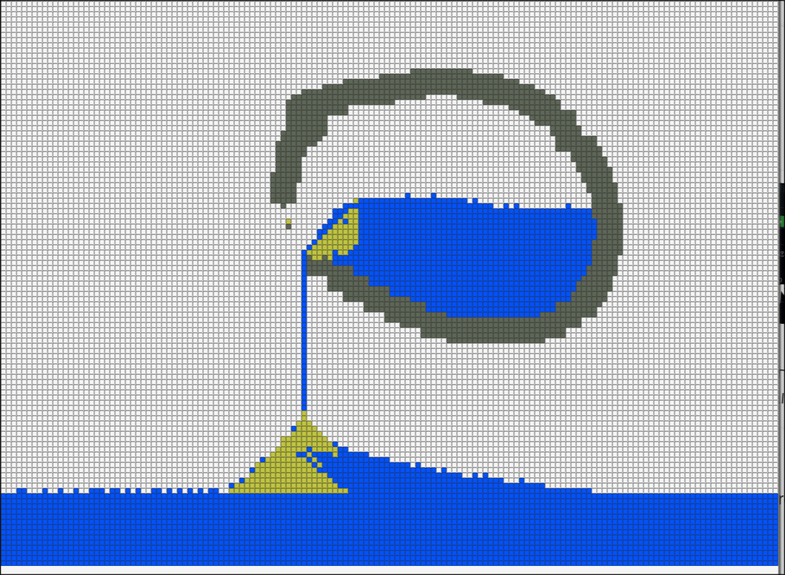

# Falling Sand Sim 🎯

## Basic Details
### Team Name: Imthias

### Team Members
- Team Lead: Imthias - RIT

### Project Description

Project is about simulating sand in a 2d dimension, along with water and solid walls, and each of their interaction with each other, using simple rules, now you can watch falling sand, water that levels itself just like in real world all implemented in C and graphics library raylib.

### The Problem (that doesn't exist)

couldnt play with huge amount of sand as they are heavy and suffocate you, neither was water, anyone could wish there just was a simulator on how sand and water behave against each other and with a solid surface of any shape :(

### The Solution (that nobody asked for)

so i made a simulation to simulate sand, it also simulate water as an added plus point, left click for creating sand, right click for creating solid objects, and right ctrl for producing water.

## Technical Details
### Technologies/Components Used
For Software:
- C programming languange
- no frameworks been used
- raylib graphics library
- gnu C compiler(gcc),makefile

### Implementation
For Software:
# Installation
gnu c compiler (gcc)
makefile
raylib graphics library

# Run

gcc main.c -o game -Wall -std=c99 -lraylib -lGL -lm -lpthread -ldl -lrt -lX11
./game

### Project Documentation
For Software:

# Screenshots (Add at least 3)

hold left click to spawn sand

you can create solid non movin object with right click of the mouse

can create water by pressing right control button

# Diagrams

*Add caption explaining your workflow*

### Project Demo
# Video

video showcasing what the software can do, it can create sand , solids, and water.

---
Made with ❤️ at TinkerHub Useless Projects 

